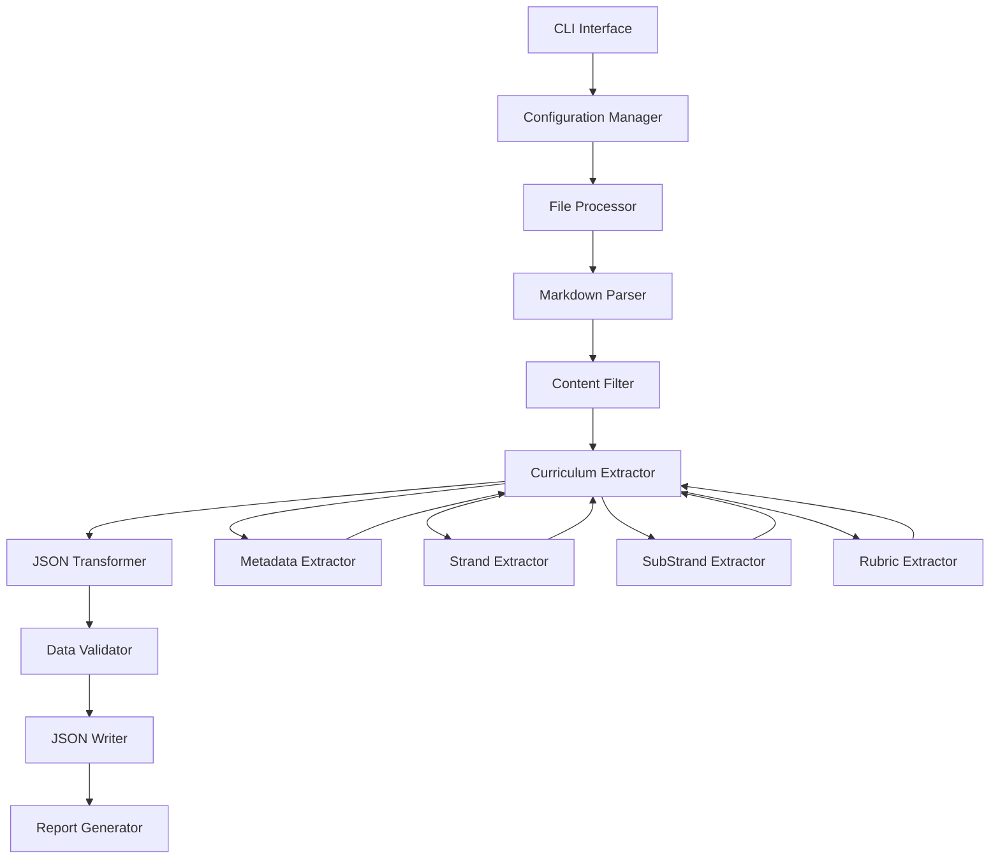

# Design Document: Curriculum Data Extraction and Transformation Tool

## Overview

The Curriculum Data Extraction and Transformation Tool is a Python-based system designed to parse Kenyan curriculum markdown files and transform them into structured JSON documents suitable for MongoDB storage. The tool processes curriculum files organized by grade level (Grades 1-12) and subject, extracting essential curriculum elements while filtering extraneous content.

### Key Objectives

1. **Parse Complex Markdown Structures**: Handle tables, nested lists, and hierarchical content
2. **Extract Curriculum Elements**: Identify and extract strands, sub-strands, learning outcomes, competencies, values, and assessment data
3. **Transform to JSON**: Convert extracted data into MongoDB-compatible JSON format
4. **Validate Data Quality**: Ensure completeness and correctness of extracted data
5. **Support Batch Processing**: Process multiple curriculum files efficiently
6. **Generate Reports**: Provide detailed processing logs and statistics

### Design Principles

- **Separation of Concerns**: Distinct components for parsing, extraction, transformation, and validation
- **Extensibility**: Modular design allowing easy addition of new extractors or transformers
- **Robustness**: Graceful error handling and detailed error reporting
- **Performance**: Efficient processing of large curriculum files
- **Maintainability**: Clear code structure with comprehensive documentation

## Architecture

### System Architecture

The system follows a pipeline architecture with four main stages:

```
[Markdown Files] → [Parser] → [Extractor] → [Transformer] → [Validator] → [JSON Output]
                                                                ↓
                                                          [Reporter]
```

### Component Architecture



### Technology Stack

- **Language**: Python 3.10+
- **Markdown Parsing**: `mistletoe` (fast, extensible, supports tables and custom tokens)
- **Data Validation**: `pydantic` v2 (type-safe validation with excellent performance)
- **JSON Handling**: Python standard library `json` module
- **File Operations**: Python standard library `pathlib`
- **Configuration**: YAML or JSON configuration files
- **Testing**: `pytest` for unit tests, property-based testing library for correctness properties

### Key Design Decisions

1. **Mistletoe for Parsing**: Selected for its speed, extensibility, and native table support. It provides an AST-based approach that allows custom token definitions for curriculum-specific structures.

2. **Pydantic for Validation**: Chosen for its Rust-based performance (5-50x faster than alternatives), type safety, and excellent error messages. Pydantic v2 provides robust JSON schema generation and validation.

3. **Pipeline Architecture**: Enables clear separation of concerns, easier testing, and the ability to swap components without affecting others.

4. **AST-Based Extraction**: Using the abstract syntax tree from mistletoe allows precise identification of curriculum elements without regex-based parsing.

## Components and Interfaces

### 1. Configuration Manager

**Purpose**: Load and manage configuration options

**Interface**:
```python
class Configuration:
    preserve_essence_statement: bool
    preserve_general_outcomes: bool
    output_directory: Path
    pretty_print: bool
    indent_size: int
    grade_range_strategy: str  # "split" or "single"
    mongodb_format: bool
    
    @classmethod
    def load(cls, config_path: Optional[Path] = None) -> Configuration
    
    def get_defaults(cls) -> Configuration
```

**Responsibilities**:
- Load configuration from file or use defaults
- Validate configuration values
- Provide configuration to other components

### 2. Markdown Parser

**Purpose**: Parse markdown files into an abstract syntax tree

**Interface**:
```python
class MarkdownParser:
    def parse_file(self, file_path: Path) -> Document
    
    def parse_string(self, content: str) -> Document
    
    def extract_tables(self, document: Document) -> List[Table]
    
    def extract_lists(self, document: Document) -> List[List]
```

**Responsibilities**:
- Read markdown files
- Parse markdown into AST using mistletoe
- Provide access to document structure
- Handle encoding issues (UTF-8)

**Implementation Notes**:
- Uses mistletoe's `Document` class as the root AST node
- Supports custom token types for curriculum-specific structures
- Handles malformed markdown gracefully

### 3. Content Filter

**Purpose**: Remove extraneous content from parsed documents

**Interface**:
```python
class ContentFilter:
    def __init__(self, config: Configuration)
    
    def filter_document(self, document: Document) -> Document
    
    def remove_section(self, document: Document, section_name: str) -> Document
    
    def should_preserve(self, section_name: str) -> bool
```

**Responsibilities**:
- Identify and remove copyright, ISBN, TOC sections
- Remove "National Goals of Education" sections
- Remove foreword, preface, acknowledgements
- Optionally preserve essence statements and general outcomes based on configuration

**Filtering Rules**:
- Match section headers case-insensitively
- Remove entire sections including subsections
- Preserve strand and sub-strand content

### 4. Metadata Extractor

**Purpose**: Extract subject, grade, and year metadata

**Interface**:
```python
class MetadataExtractor:
    def extract_from_filename(self, filename: str) -> Metadata
    
    def extract_from_content(self, document: Document) -> Metadata
    
    def normalize_subject(self, subject: str) -> str
    
    def parse_grade(self, grade_str: str) -> Union[int, Tuple[int, int]]
```

**Responsibilities**:
- Extract subject name from filename or content
- Extract grade level (single or range)
- Extract year
- Normalize subject names (handle special characters, multiple words)
- Handle various grade formats ("Grade 10", "Gredi 10", "G 10", "Grade 1-3")

**Extraction Patterns**:
- Filename pattern: `{Subject} Grade {N} - {Month} {Year}.md`
- Content pattern: Look for headers with grade and subject information

### 5. Strand Extractor

**Purpose**: Extract strand information from curriculum content

**Interface**:
```python
class StrandExtractor:
    def extract_strands(self, document: Document) -> List[Strand]
    
    def identify_strand_header(self, node: Node) -> Optional[StrandInfo]
    
    def extract_strand_content(self, start_node: Node, end_node: Node) -> StrandContent
```

**Responsibilities**:
- Identify strand headers (e.g., "STRAND 1.0: PICTURE MAKING")
- Extract strand ID and name
- Maintain sequential order
- Associate sub-strands with strands
- Extract strand-level assessment rubrics

**Identification Strategy**:
- Look for headers containing "STRAND" followed by numeric ID
- Parse strand ID (e.g., "1.0", "2.0")
- Extract strand name after colon

### 6. SubStrand Extractor

**Purpose**: Extract sub-strand information and associated content

**Interface**:
```python
class SubStrandExtractor:
    def extract_substrands(self, strand_content: StrandContent) -> List[SubStrand]
    
    def extract_table_content(self, table: Table) -> SubStrandData
    
    def parse_learning_outcomes(self, cell_content: str) -> List[str]
    
    def parse_learning_experiences(self, cell_content: str) -> List[str]
    
    def parse_inquiry_questions(self, cell_content: str) -> List[str]
```

**Responsibilities**:
- Identify sub-strand tables
- Extract sub-strand ID, name, and topics
- Extract specific learning outcomes
- Extract suggested learning experiences
- Extract key inquiry questions
- Extract core competencies with context
- Extract values with context
- Extract PCIs
- Extract suggested resources
- Extract assessment methods

**Table Structure Recognition**:
- Identify table headers: "Strand", "Sub Strand", "Specific Learning Outcomes", "Suggested Learning Experiences", "Suggested Key Inquiry Question(s)"
- Handle multi-row sub-strands
- Parse nested lists within table cells

### 7. Rubric Extractor

**Purpose**: Extract assessment rubric tables

**Interface**:
```python
class RubricExtractor:
    def extract_rubrics(self, strand_content: StrandContent) -> List[AssessmentRubric]
    
    def identify_rubric_table(self, table: Table) -> bool
    
    def parse_rubric_row(self, row: TableRow) -> RubricCriterion
```

**Responsibilities**:
- Identify assessment rubric tables
- Extract performance levels (headers)
- Extract indicators/criteria
- Extract performance descriptions for each level
- Handle split rubrics across pages

**Rubric Structure**:
- Headers: "Indicators", "Exceeds Expectation", "Meets Expectation", "Approaches Expectation", "Below Expectation"
- Each row represents one criterion with descriptions for each performance level

### 8. JSON Transformer

**Purpose**: Transform extracted data into JSON structure

**Interface**:
```python
class JSONTransformer:
    def transform(self, curriculum_data: CurriculumData) -> Dict[str, Any]
    
    def transform_strand(self, strand: Strand) -> Dict[str, Any]
    
    def transform_substrand(self, substrand: SubStrand) -> Dict[str, Any]
    
    def escape_special_chars(self, text: str) -> str
```

**Responsibilities**:
- Create JSON structure with required fields
- Transform all curriculum elements to JSON-compatible types
- Escape special characters
- Ensure valid JSON output
- Handle MongoDB field name restrictions (no dots or dollar signs)

**JSON Structure**:
```json
{
  "subject": "string",
  "grade": "integer or object with range",
  "year": "integer",
  "essence_statement": "string (optional)",
  "general_learning_outcomes": ["string"] (optional),
  "strands": [
    {
      "strand_id": "string",
      "strand_name": "string",
      "sub_strands": [
        {
          "sub_strand_id": "string",
          "sub_strand_name": "string",
          "topics": ["string"],
          "specific_learning_outcomes": ["string"],
          "suggested_learning_experiences": ["string"],
          "key_inquiry_questions": ["string"],
          "core_competencies": [
            {"competency": "string", "context": "string"}
          ],
          "values": [
            {"value": "string", "context": "string"}
          ],
          "pcis": ["string"],
          "suggested_resources": ["string"],
          "assessment_methods": ["string"]
        }
      ],
      "assessment_rubric": [
        {
          "indicator": "string",
          "exceeds_expectation": "string",
          "meets_expectation": "string",
          "approaches_expectation": "string",
          "below_expectation": "string"
        }
      ]
    }
  ]
}
```

### 9. Data Validator

**Purpose**: Validate extracted and transformed data

**Interface**:
```python
class DataValidator:
    def validate(self, curriculum_data: CurriculumData) -> ValidationResult
    
    def validate_metadata(self, metadata: Metadata) -> List[ValidationError]
    
    def validate_strands(self, strands: List[Strand]) -> List[ValidationError]
    
    def validate_uniqueness(self, ids: List[str], context: str) -> List[ValidationError]
```

**Responsibilities**:
- Validate required fields are present
- Validate strand ID uniqueness within document
- Validate sub-strand ID uniqueness within strand
- Validate grade is integer between 1-12
- Validate year is four-digit integer
- Validate logical requirements (e.g., strands array not empty)
- Return detailed validation errors

**Validation Rules**:
- Required fields: subject, grade, year, strands
- Strand IDs must be unique
- Sub-strand IDs must be unique within strand
- Grade: 1 ≤ grade ≤ 12
- Year: 1900 ≤ year ≤ 2100

### 10. Pretty Printer

**Purpose**: Format JSON output for human readability

**Interface**:
```python
class PrettyPrinter:
    def __init__(self, indent_size: int = 2)
    
    def format_json(self, data: Dict[str, Any]) -> str
    
    def write_json(self, data: Dict[str, Any], output_path: Path) -> None
```

**Responsibilities**:
- Format JSON with proper indentation
- Use configurable indentation size
- Ensure valid JSON output
- Write formatted JSON to file

**Formatting Rules**:
- Default 2-space indentation
- Opening braces on same line as key
- Closing braces on new line at appropriate indentation
- Consistent formatting throughout

### 11. File Processor

**Purpose**: Orchestrate processing of single or multiple files

**Interface**:
```python
class FileProcessor:
    def __init__(self, config: Configuration)
    
    def process_file(self, input_path: Path) -> ProcessingResult
    
    def process_directory(self, directory_path: Path) -> BatchProcessingResult
    
    def generate_output_filename(self, input_filename: str) -> str
```

**Responsibilities**:
- Coordinate all processing stages
- Handle single file processing
- Handle batch directory processing
- Generate output filenames
- Manage error handling and recovery
- Continue processing on individual file failures

**Processing Pipeline**:
1. Parse markdown file
2. Filter extraneous content
3. Extract metadata
4. Extract strands and sub-strands
5. Transform to JSON
6. Validate data
7. Write JSON output
8. Generate processing report

### 12. Report Generator

**Purpose**: Generate processing reports and statistics

**Interface**:
```python
class ReportGenerator:
    def generate_file_report(self, result: ProcessingResult) -> FileReport
    
    def generate_batch_report(self, results: List[ProcessingResult]) -> BatchReport
    
    def write_report(self, report: Report, output_path: Path) -> None
```

**Responsibilities**:
- Generate per-file processing reports
- Generate batch processing summary reports
- Include counts of extracted elements
- Include warnings and errors
- Include processing time
- Calculate aggregate statistics

**Report Contents**:
- Input/output file names
- Processing status (success/failure)
- Element counts (strands, sub-strands, etc.)
- Warnings and errors
- Processing time
- Aggregate statistics for batch processing

## Data Models

### Pydantic Models for Validation

```python
from pydantic import BaseModel, Field, field_validator
from typing import List, Optional, Union

class Competency(BaseModel):
    competency: str
    context: str

class Value(BaseModel):
    value: str
    context: str

class SubStrand(BaseModel):
    sub_strand_id: str
    sub_strand_name: str
    topics: List[str] = Field(default_factory=list)
    specific_learning_outcomes: List[str] = Field(default_factory=list)
    suggested_learning_experiences: List[str] = Field(default_factory=list)
    key_inquiry_questions: List[str] = Field(default_factory=list)
    core_competencies: List[Competency] = Field(default_factory=list)
    values: List[Value] = Field(default_factory=list)
    pcis: List[str] = Field(default_factory=list)
    suggested_resources: List[str] = Field(default_factory=list)
    assessment_methods: List[str] = Field(default_factory=list)

class RubricCriterion(BaseModel):
    indicator: str
    exceeds_expectation: str
    meets_expectation: str
    approaches_expectation: str
    below_expectation: str

class Strand(BaseModel):
    strand_id: str
    strand_name: str
    sub_strands: List[SubStrand] = Field(default_factory=list)
    assessment_rubric: List[RubricCriterion] = Field(default_factory=list)

class GradeRange(BaseModel):
    start: int = Field(ge=1, le=12)
    end: int = Field(ge=1, le=12)

class CurriculumDocument(BaseModel):
    subject: str
    grade: Union[int, GradeRange]
    year: int = Field(ge=1900, le=2100)
    essence_statement: Optional[str] = None
    general_learning_outcomes: List[str] = Field(default_factory=list)
    strands: List[Strand]
    
    @field_validator('grade')
    @classmethod
    def validate_grade(cls, v):
        if isinstance(v, int):
            if not 1 <= v <= 12:
                raise ValueError('Grade must be between 1 and 12')
        elif isinstance(v, GradeRange):
            if v.start > v.end:
                raise ValueError('Grade range start must be <= end')
        return v
    
    @field_validator('strands')
    @classmethod
    def validate_strands_not_empty(cls, v):
        if not v:
            raise ValueError('Strands array cannot be empty')
        return v
```

## Error Handling

### Error Categories

1. **File Errors**: File not found, permission denied, encoding issues
2. **Parse Errors**: Malformed markdown, unexpected structure
3. **Extraction Errors**: Missing required elements, ambiguous content
4. **Validation Errors**: Invalid data, missing required fields
5. **Transformation Errors**: JSON serialization failures
6. **Configuration Errors**: Invalid configuration values

### Error Handling Strategy

- **Graceful Degradation**: Continue processing when possible
- **Detailed Error Messages**: Include context and location information
- **Error Recovery**: Attempt to extract partial data when full extraction fails
- **Logging**: Comprehensive logging at different levels (DEBUG, INFO, WARNING, ERROR)
- **User-Friendly Messages**: Clear, actionable error messages

### Error Reporting

```python
class ProcessingError(Exception):
    def __init__(self, message: str, file_path: Path, context: Optional[str] = None):
        self.message = message
        self.file_path = file_path
        self.context = context
        super().__init__(self.format_message())
    
    def format_message(self) -> str:
        msg = f"Error processing {self.file_path}: {self.message}"
        if self.context:
            msg += f"\nContext: {self.context}"
        return msg
```

## Testing Strategy

### Unit Testing

Unit tests will verify specific behaviors and edge cases for each component:

- **Parser Tests**: Test markdown parsing with various structures, malformed input, encoding issues
- **Extractor Tests**: Test extraction of each curriculum element type, missing elements, malformed tables
- **Transformer Tests**: Test JSON generation, special character escaping, MongoDB compatibility
- **Validator Tests**: Test validation rules, error detection, edge cases
- **Filter Tests**: Test content filtering, section identification, preservation rules
- **Configuration Tests**: Test configuration loading, defaults, validation

### Integration Testing

Integration tests will verify the complete pipeline:

- **End-to-End Tests**: Process sample curriculum files and verify complete output
- **Batch Processing Tests**: Process multiple files and verify batch reports
- **Error Recovery Tests**: Verify graceful handling of errors in pipeline
- **Configuration Integration**: Test different configuration combinations

### Property-Based Testing

Property-based tests will verify universal properties across all valid inputs. The tool will use a property-based testing library (e.g., Hypothesis for Python) to generate random curriculum data and verify correctness properties.

**Configuration**:
- Minimum 100 iterations per property test
- Each test tagged with reference to design property
- Tag format: `# Feature: curriculum-data-extractor, Property {number}: {property_text}`

**Test Data Generation**:
- Generate valid curriculum structures with random content
- Generate edge cases (empty arrays, special characters, Unicode)
- Generate invalid data to test error handling

### Test Coverage Goals

- Unit test coverage: ≥ 90%
- Integration test coverage: ≥ 80%
- Property test coverage: All correctness properties
- Edge case coverage: All identified edge cases


## Correctness Properties

*A property is a characteristic or behavior that should hold true across all valid executions of a system—essentially, a formal statement about what the system should do. Properties serve as the bridge between human-readable specifications and machine-verifiable correctness guarantees.*

### Property 1: Round-Trip Transformation Preserves Data

*For any* valid curriculum markdown file, parsing the file, transforming to JSON, and parsing the JSON SHALL produce a data structure equivalent to the original parsed structure.

**Validates: Requirements 20.1, 20.2, 20.3, 20.4, 20.5**

**Rationale**: This is the fundamental correctness property for data transformation. If we can round-trip the data without loss, we know the transformation is correct. This property subsumes many individual extraction properties because if the round-trip works, all data must have been correctly extracted and transformed.

### Property 2: Table Structure Preservation

*For any* markdown table in a curriculum file, parsing and extracting the table SHALL preserve all row and column relationships, such that for any cell at position (row, col) in the original table, the extracted data contains the same content at the same position.

**Validates: Requirements 1.2, 14.1, 14.2, 14.3, 14.4, 14.5**

**Rationale**: Tables are critical structures in curriculum files (sub-strand tables, rubric tables). Preserving their structure is essential for correct data extraction.

### Property 3: Hierarchical Structure Preservation

*For any* nested list structure in a curriculum file, parsing SHALL preserve the hierarchical relationships, such that parent-child relationships and nesting depth are maintained in the parsed representation.

**Validates: Requirements 1.3, 7.4**

**Rationale**: Nested lists appear in learning experiences and other curriculum elements. Preserving hierarchy ensures we don't lose the structure of the content.

### Property 4: Metadata Extraction Completeness

*For any* valid curriculum file with subject, grade, and year information in the filename or content, the extractor SHALL successfully extract all three metadata fields with correct values.

**Validates: Requirements 1.5, 1.6, 1.7, 2.1, 2.2, 2.3**

**Rationale**: Metadata is essential for categorizing curriculum documents. This property ensures we can always extract the required metadata from valid files.

### Property 5: Grade Format Normalization

*For any* grade specification in formats "Grade X", "Gredi X", "G X", or "Grade X-Y", the extractor SHALL extract the numeric value(s) correctly, producing either an integer for single grades or a range object for grade ranges.

**Validates: Requirements 2.5, 2.6, 18.1, 18.2**

**Rationale**: Curriculum files use various grade formats. Normalization ensures consistent representation regardless of input format.

### Property 6: Subject Name Normalization Idempotence

*For any* subject name, normalizing it once and normalizing it again SHALL produce the same result (normalization is idempotent).

**Validates: Requirements 2.4**

**Rationale**: Idempotence ensures that normalization is stable and doesn't introduce inconsistencies through repeated application.

### Property 7: Content Filtering Preserves Essential Data

*For any* curriculum file, filtering to remove extraneous content (copyright, TOC, National Goals, etc.) SHALL preserve all strand, sub-strand, and curriculum element content while removing only the specified extraneous sections.

**Validates: Requirements 3.1, 3.2, 3.3, 3.4, 3.5, 3.6, 3.7**

**Rationale**: Filtering must be precise - remove what should be removed, keep what should be kept. This property ensures we don't accidentally remove curriculum content.

### Property 8: Configuration-Based Preservation

*For any* curriculum file with essence statements or general learning outcomes, when configuration specifies preservation, these elements SHALL be present in the output, and when configuration specifies removal, these elements SHALL be absent from the output.

**Validates: Requirements 3.8, 3.9, 23.1, 23.2**

**Rationale**: Configuration should deterministically control behavior. This property ensures configuration options work as expected.

### Property 9: Element Extraction Completeness

*For any* curriculum file with N strands, the extractor SHALL identify and extract exactly N strands, and for each strand with M sub-strands, the extractor SHALL identify and extract exactly M sub-strands.

**Validates: Requirements 4.1, 4.2, 4.3, 5.1, 5.2, 5.3**

**Rationale**: Completeness is critical - we must extract all curriculum elements, not just some of them.

### Property 10: Sequential Order Preservation

*For any* curriculum file, the order of strands in the output SHALL match the order of strands in the input, and the order of sub-strands within each strand in the output SHALL match the order in the input.

**Validates: Requirements 4.4, 5.5**

**Rationale**: Order matters in curriculum documents. Preserving order ensures the curriculum structure remains intact.

### Property 11: Empty Collection Representation

*For any* strand with no sub-strands, the output SHALL contain an empty sub-strands array, and for any sub-strand with no elements of a particular type (outcomes, experiences, etc.), the output SHALL contain an empty array for that field.

**Validates: Requirements 4.5, 24.1, 24.2, 24.3, 24.4, 24.5, 24.6, 24.7, 24.8**

**Rationale**: Empty collections should be represented consistently as empty arrays, not null or missing fields. This ensures consistent data structure.

### Property 12: List Element Extraction Preserves Content

*For any* list of curriculum elements (learning outcomes, experiences, inquiry questions, PCIs, resources, assessment methods), extraction SHALL preserve the text content of each element while removing formatting markers (bullets, numbering, bold, italic).

**Validates: Requirements 6.1, 6.2, 6.3, 6.4, 6.5, 7.1, 7.2, 7.3, 7.5, 8.1, 8.2, 8.3, 8.4, 11.1, 11.2, 11.3, 11.4, 12.1, 12.2, 12.3, 12.4, 13.1, 13.2, 13.3, 13.4**

**Rationale**: Content must be preserved while formatting is normalized. This property ensures we don't lose information during extraction.

### Property 13: Structured Data Extraction Correctness

*For any* competency or value with format "Name: Context" or "Name - Context", extraction SHALL produce an object with separate "name" and "context" fields containing the correct text from before and after the separator.

**Validates: Requirements 9.1, 9.2, 9.3, 9.4, 9.5, 9.6, 10.1, 10.2, 10.3, 10.4, 10.5, 10.6**

**Rationale**: Structured data must be correctly parsed into its components. This property ensures we correctly identify and separate the parts.

### Property 14: Rubric Structure Correctness

*For any* assessment rubric table with indicators and performance levels, extraction SHALL produce a structured representation where each indicator maps to descriptions for all performance levels (exceeds, meets, approaches, below expectation).

**Validates: Requirements 14.1, 14.2, 14.3, 14.4, 14.5, 14.6**

**Rationale**: Rubrics have a specific structure that must be preserved. This property ensures the rubric structure is correctly represented.

### Property 15: JSON Validity

*For any* extracted curriculum data, transformation to JSON SHALL produce valid JSON that can be parsed by standard JSON parsers without errors.

**Validates: Requirements 15.1, 15.2, 15.3, 15.4, 15.5, 15.6, 15.7, 19.1, 19.2, 19.3, 19.4, 19.5**

**Rationale**: The output must be valid JSON. This property ensures we always produce parseable JSON.

### Property 16: Special Character Preservation

*For any* text content containing Unicode characters, special symbols, or formatting characters, extraction and transformation SHALL preserve these characters correctly in the JSON output.

**Validates: Requirements 21.1, 21.2, 21.3, 21.4, 21.5, 21.6**

**Rationale**: Curriculum content may contain special characters (bullets, dashes, accented characters). These must be preserved accurately.

### Property 17: Validation Detects Invalid Data

*For any* curriculum data with missing required fields, invalid grade values, invalid year values, or duplicate IDs, validation SHALL detect and report these errors.

**Validates: Requirements 16.1, 16.2, 16.3, 16.4, 16.5, 16.6, 16.7**

**Rationale**: Validation must catch all invalid data. This property ensures validation rules are correctly implemented.

### Property 18: Batch Processing Independence

*For any* set of curriculum files, processing them in batch SHALL produce the same output for each file as processing them individually, and failure of one file SHALL not prevent processing of other files.

**Validates: Requirements 17.1, 17.2, 17.3, 17.4, 17.5, 17.6**

**Rationale**: Batch processing should be equivalent to individual processing. This property ensures batch processing doesn't introduce errors or dependencies between files.

### Property 19: MongoDB Field Name Compliance

*For any* generated JSON document, all field names SHALL not contain dots (.) or dollar signs ($), and the document size SHALL not exceed MongoDB's 16MB limit.

**Validates: Requirements 25.1, 25.2, 25.3, 25.4**

**Rationale**: MongoDB has specific field name restrictions. This property ensures our output is compatible with MongoDB.

### Property 20: Processing Report Accuracy

*For any* processed curriculum file, the processing report SHALL contain accurate counts of extracted elements (strands, sub-strands, etc.) that match the actual counts in the output JSON.

**Validates: Requirements 22.1, 22.2, 22.3, 22.4, 22.5, 22.6**

**Rationale**: Reports must be accurate. This property ensures report data matches actual processing results.

### Property 21: Error Messages Are Descriptive

*For any* processing error (file not found, parse error, validation error), the system SHALL return an error message that includes the error type, the file path, and specific context about what failed.

**Validates: Requirements 1.4**

**Rationale**: Error messages must be actionable. This property ensures errors provide enough information for debugging.

### Property 22: Configuration Loading Consistency

*For any* valid configuration file, loading the configuration SHALL produce the same Configuration object regardless of how many times it is loaded.

**Validates: Requirements 23.3, 23.4, 23.5, 23.6, 23.7**

**Rationale**: Configuration loading should be deterministic and consistent. This property ensures configuration behaves predictably.


## Testing Strategy

### Dual Testing Approach

The testing strategy employs both unit tests and property-based tests to ensure comprehensive coverage:

**Unit Tests** focus on:
- Specific examples demonstrating correct behavior
- Edge cases (empty files, missing sections, malformed tables)
- Error conditions (file not found, invalid encoding, parse errors)
- Integration points between components
- Configuration loading and validation
- Report generation accuracy

**Property-Based Tests** focus on:
- Universal properties that hold across all valid inputs
- Comprehensive input coverage through randomization
- Round-trip transformations
- Data preservation guarantees
- Validation rule enforcement

### Property-Based Testing Configuration

- **Library**: Hypothesis for Python
- **Iterations**: Minimum 100 iterations per property test
- **Tagging**: Each property test tagged with reference to design property
- **Tag Format**: `# Feature: curriculum-data-extractor, Property {number}: {property_text}`

### Test Data Generation Strategy

**For Property-Based Tests**:
- Generate valid curriculum structures with random content
- Generate edge cases: empty arrays, special characters, Unicode, very long strings
- Generate invalid data to test error handling and validation
- Generate various markdown structures: tables, nested lists, headers
- Generate different metadata formats: various grade formats, subject names with special characters

**Custom Generators**:
```python
# Example Hypothesis strategies for curriculum data generation
@st.composite
def curriculum_document(draw):
    subject = draw(st.text(min_size=1, max_size=100))
    grade = draw(st.integers(min_value=1, max_value=12))
    year = draw(st.integers(min_value=2020, max_value=2030))
    num_strands = draw(st.integers(min_value=1, max_value=5))
    strands = draw(st.lists(strand(), min_size=num_strands, max_size=num_strands))
    return CurriculumDocument(subject=subject, grade=grade, year=year, strands=strands)

@st.composite
def strand(draw):
    strand_id = draw(st.text(min_size=1, max_size=10))
    strand_name = draw(st.text(min_size=1, max_size=200))
    num_substrands = draw(st.integers(min_value=0, max_value=10))
    sub_strands = draw(st.lists(substrand(), min_size=num_substrands, max_size=num_substrands))
    return Strand(strand_id=strand_id, strand_name=strand_name, sub_strands=sub_strands)
```

### Unit Test Organization

```
tests/
├── unit/
│   ├── test_parser.py
│   ├── test_metadata_extractor.py
│   ├── test_content_filter.py
│   ├── test_strand_extractor.py
│   ├── test_substrand_extractor.py
│   ├── test_rubric_extractor.py
│   ├── test_json_transformer.py
│   ├── test_validator.py
│   ├── test_pretty_printer.py
│   ├── test_configuration.py
│   └── test_report_generator.py
├── integration/
│   ├── test_pipeline.py
│   ├── test_batch_processing.py
│   └── test_error_recovery.py
├── property/
│   ├── test_roundtrip_properties.py
│   ├── test_extraction_properties.py
│   ├── test_transformation_properties.py
│   └── test_validation_properties.py
└── fixtures/
    ├── sample_curriculum_files/
    └── expected_outputs/
```

### Test Coverage Goals

- **Unit Test Coverage**: ≥ 90% code coverage
- **Integration Test Coverage**: ≥ 80% code coverage
- **Property Test Coverage**: All 22 correctness properties implemented
- **Edge Case Coverage**: All identified edge cases tested

### Testing Best Practices

1. **Isolation**: Each unit test tests one component in isolation with mocked dependencies
2. **Clarity**: Test names clearly describe what is being tested
3. **Repeatability**: Tests produce consistent results across runs
4. **Fast Execution**: Unit tests run quickly; property tests may take longer
5. **Comprehensive Fixtures**: Maintain a library of sample curriculum files covering various structures
6. **Continuous Integration**: All tests run on every commit

### Example Property Test

```python
from hypothesis import given, strategies as st
import pytest

# Feature: curriculum-data-extractor, Property 1: Round-Trip Transformation Preserves Data
@given(curriculum_document())
def test_roundtrip_transformation_preserves_data(curriculum_doc):
    """
    For any valid curriculum document, parsing → transforming to JSON → 
    parsing JSON should produce equivalent data structure.
    """
    # Transform to JSON
    json_output = JSONTransformer().transform(curriculum_doc)
    
    # Parse JSON back
    parsed_doc = CurriculumDocument.model_validate_json(json_output)
    
    # Assert equivalence
    assert parsed_doc == curriculum_doc
```

### Example Unit Test

```python
def test_metadata_extractor_handles_grade_range():
    """Test that metadata extractor correctly parses grade ranges like 'Grade 1-3'"""
    extractor = MetadataExtractor()
    
    # Test single grade
    result = extractor.parse_grade("Grade 10")
    assert result == 10
    
    # Test grade range
    result = extractor.parse_grade("Grade 1-3")
    assert result == GradeRange(start=1, end=3)
    
    # Test alternative format
    result = extractor.parse_grade("Gredi 5")
    assert result == 5
```

## Deployment and Usage

### Installation

```bash
# Install from PyPI (when published)
pip install curriculum-data-extractor

# Or install from source
git clone https://github.com/org/curriculum-data-extractor.git
cd curriculum-data-extractor
pip install -e .
```

### Command-Line Interface

```bash
# Process a single file
curriculum-extract input.md -o output.json

# Process a directory
curriculum-extract input_dir/ -o output_dir/

# With configuration file
curriculum-extract input.md -c config.yaml -o output.json

# Generate MongoDB import script
curriculum-extract input.md -o output.json --mongodb-script

# Verbose output
curriculum-extract input.md -o output.json -v
```

### Configuration File Example

```yaml
# config.yaml
preserve_essence_statement: true
preserve_general_outcomes: true
output_directory: ./output
pretty_print: true
indent_size: 2
grade_range_strategy: split  # or "single"
mongodb_format: true
```

### Python API Usage

```python
from curriculum_extractor import CurriculumExtractor, Configuration

# Create configuration
config = Configuration(
    preserve_essence_statement=True,
    pretty_print=True,
    indent_size=2
)

# Create extractor
extractor = CurriculumExtractor(config)

# Process single file
result = extractor.process_file("input.md")
if result.success:
    print(f"Successfully processed: {result.output_path}")
    print(f"Extracted {result.strand_count} strands")
else:
    print(f"Error: {result.error_message}")

# Process directory
batch_result = extractor.process_directory("input_dir/")
print(f"Processed {batch_result.success_count}/{batch_result.total_count} files")
```

### MongoDB Import

```bash
# After generating JSON files, import to MongoDB
mongoimport --db curriculum --collection documents --file output.json

# Or use the generated import script
./import_to_mongodb.sh
```

## Performance Considerations

### Expected Performance

- **Single File Processing**: < 1 second for typical curriculum file (500-1000 lines)
- **Batch Processing**: Linear scaling with number of files
- **Memory Usage**: < 100MB for typical curriculum file
- **Large Files**: Files up to 10MB should process in < 5 seconds

### Optimization Strategies

1. **Lazy Parsing**: Parse markdown incrementally rather than loading entire file into memory
2. **Caching**: Cache parsed AST for repeated operations
3. **Parallel Processing**: Process multiple files in parallel during batch operations
4. **Efficient Data Structures**: Use appropriate data structures for lookups and storage
5. **Streaming JSON**: For very large outputs, stream JSON writing rather than building entire string in memory

### Performance Monitoring

- Log processing time for each file
- Track memory usage during processing
- Identify bottlenecks through profiling
- Set performance benchmarks and monitor regressions

## Security Considerations

### Input Validation

- Validate file paths to prevent directory traversal attacks
- Limit file size to prevent memory exhaustion
- Validate markdown content to prevent malicious input
- Sanitize output paths

### Data Privacy

- Curriculum files may contain sensitive information
- Ensure proper access controls on input and output directories
- Log only non-sensitive information
- Provide option to redact sensitive data

### Dependency Security

- Regularly update dependencies to patch security vulnerabilities
- Use dependency scanning tools (e.g., Safety, Snyk)
- Pin dependency versions for reproducibility
- Review security advisories for mistletoe, pydantic, and other dependencies

## Maintenance and Extensibility

### Adding New Extractors

To add a new extractor for additional curriculum elements:

1. Create new extractor class inheriting from `BaseExtractor`
2. Implement `extract()` method
3. Add corresponding Pydantic model for validation
4. Update JSON transformer to include new element
5. Add unit tests and property tests
6. Update documentation

### Modifying Extraction Logic

- Extraction logic is centralized in extractor classes
- Modify extractor methods to change extraction behavior
- Update tests to reflect new behavior
- Maintain backward compatibility or provide migration path

### Supporting New Markdown Structures

- Extend mistletoe with custom token types if needed
- Update parser to recognize new structures
- Add extractors for new structures
- Update data models and transformers

### Version Compatibility

- Maintain compatibility with curriculum file format changes
- Provide version detection and appropriate parsing strategies
- Support multiple curriculum format versions simultaneously
- Document breaking changes and migration paths

## Appendix: Sample Data Structures

### Sample Input Markdown

```markdown
# STRAND 1.0: PICTURE MAKING TECHNIQUES (2D ART)

| Strand | Sub Strand | Specific Learning Outcomes | Suggested Learning Experiences | Suggested Key Inquiry Question(s) |
|--------|------------|---------------------------|-------------------------------|----------------------------------|
| 1.0 Picture Making | 1.1 Drawing | By the end of the sub strand the learner should be able to: a) analyse contour techniques, b) draw human figures | The learner is guided to: • study aspects of contour drawing • practice contour drawing | 1. How can lines be used to capture posture? |

**Core Competencies to be developed**
• Learning to learn: the learner analyses contour drawing
• Creativity: the learner creates human figure compositions

**Values**
• Respect: the learner uses appropriate language
• Unity: the learner takes turns

**Pertinent and Contemporary Issues (PCIs)**
• Citizenship Education: the learner sketches human forms
• Cyber security: the learner explores virtual resources

**Suggested Learning Resources:**
Live models, Internet connectivity, drawing papers, pencils
```

### Sample Output JSON

```json
{
  "subject": "Fine Arts",
  "grade": 11,
  "year": 2025,
  "strands": [
    {
      "strand_id": "1.0",
      "strand_name": "Picture Making Techniques (2D Art)",
      "sub_strands": [
        {
          "sub_strand_id": "1.1",
          "sub_strand_name": "Drawing",
          "topics": ["Contour drawing", "Gesture drawing"],
          "specific_learning_outcomes": [
            "analyse contour techniques",
            "draw human figures"
          ],
          "suggested_learning_experiences": [
            "study aspects of contour drawing",
            "practice contour drawing"
          ],
          "key_inquiry_questions": [
            "How can lines be used to capture posture?"
          ],
          "core_competencies": [
            {
              "competency": "Learning to learn",
              "context": "the learner analyses contour drawing"
            },
            {
              "competency": "Creativity",
              "context": "the learner creates human figure compositions"
            }
          ],
          "values": [
            {
              "value": "Respect",
              "context": "the learner uses appropriate language"
            },
            {
              "value": "Unity",
              "context": "the learner takes turns"
            }
          ],
          "pcis": [
            "Citizenship Education: the learner sketches human forms",
            "Cyber security: the learner explores virtual resources"
          ],
          "suggested_resources": [
            "Live models",
            "Internet connectivity",
            "drawing papers",
            "pencils"
          ],
          "assessment_methods": []
        }
      ],
      "assessment_rubric": []
    }
  ]
}
```

## Conclusion

This design document provides a comprehensive blueprint for the Curriculum Data Extraction and Transformation Tool. The system architecture emphasizes modularity, extensibility, and correctness through property-based testing. By following this design, the implementation will produce a robust, maintainable tool that accurately transforms Kenyan curriculum markdown files into structured JSON suitable for MongoDB storage.

The key strengths of this design are:

1. **Clear Separation of Concerns**: Each component has a well-defined responsibility
2. **Comprehensive Testing Strategy**: Both unit tests and property-based tests ensure correctness
3. **Extensibility**: New extractors and transformers can be added easily
4. **Robustness**: Graceful error handling and detailed reporting
5. **Performance**: Efficient processing of large curriculum files
6. **MongoDB Compatibility**: Output format designed for direct MongoDB import

The implementation of this design will provide curriculum data managers with a reliable tool for transforming curriculum documents into a structured, queryable format suitable for modern data management systems.
